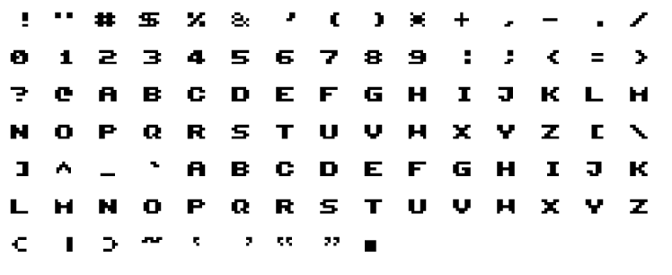

# Protracker v2.3D/v2.3E Font

While making my [PT.Config-XX editor](http://echolevel.co.uk/ptconfig), I wanted to make a dynamic preview window that would reflect changes to the colour palette.
I couldn't find the Protracker 2-era bitmap font in a browser-friendly format, so I used FontStruct to create it myself using
8bitbubsy's [Protracker 2.3E source code](https://sourceforge.net/p/protracker/code/HEAD/tree/) as a guide.

See below for the full repertoire of characters.

There are lots of similar-looking 8x8 pixel bitmap fonts out there...but none quite the same. It's short, fat (actually only 5px high), Commodore-y and 
quite delightful. It may have been originally made by a Protracker coder in the early 90s, or it might well preexist that and have 
been ripped from something else. If anyone knows for sure, I'd be happy to add credits here. Meanwhile, please enjoy!

### Changelog

 * makes sense for this to be monospace...so now it is!
 * whitespace separator was nonexistent - fixed
 * B character was missing two pixels - fixed

